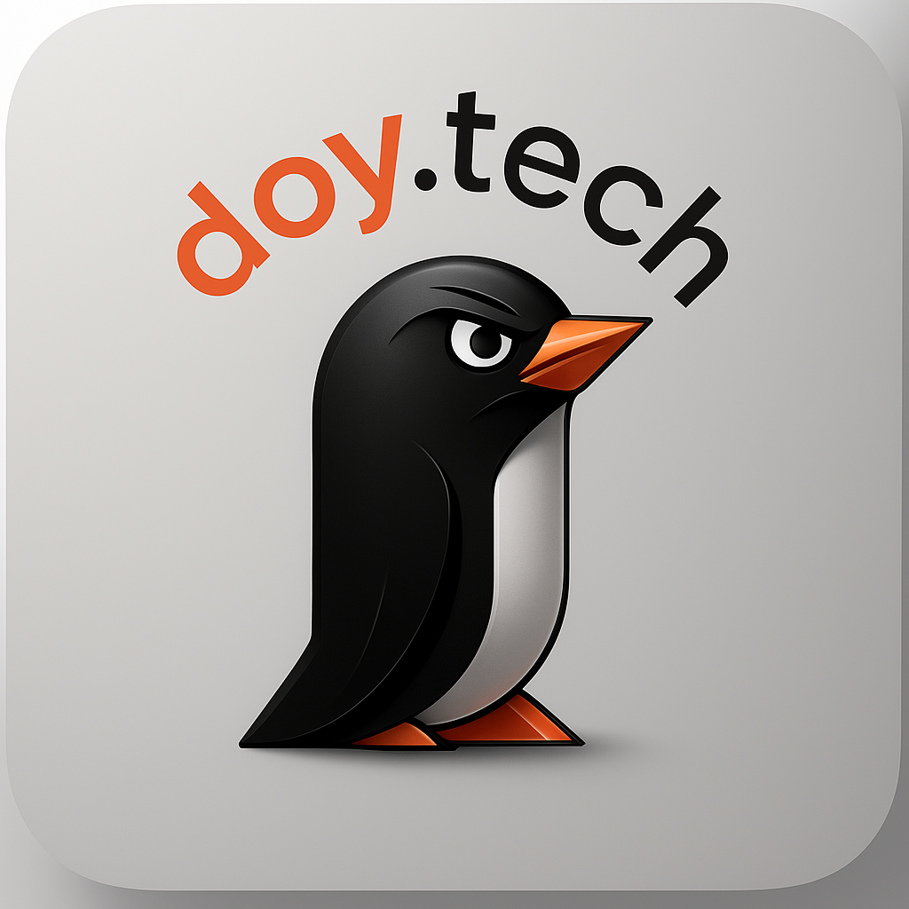

<!-- Distinctly Unique & Beautiful Profile by Hasan AlDoy -->

  

<h1 align="center" style="font-size:3em; letter-spacing:2px; color:#0D0D0D; background: linear-gradient(90deg,#EDEDED,#0D0D0D); border-radius: 1em; padding: 0.5em 0;">قوه..
   إسمي حسن الدّوي
</h1>

أنا من البحرين 🇧🇭

<h1 align="center" style="font-size:3em; letter-spacing:2px; color:#0D0D0D; background: linear-gradient(90deg,#EDEDED,#0D0D0D); border-radius: 1em; padding: 0.5em 0;">Hi..
   My Name is Hasan AlDoy
</h1>

I am from Bahrain 🇧🇭

<h2 align="center" style="font-family:monospace; color:#0D0D0D;">Code is Poetry &mdash; Coding is Art</h2>

  

  

---

## Hi 👋, I'm Hasan AlDoy 🐧

**Apache Royale Penguin 🐧**  
**Wandering the Arabian Desert**

- Born in [R.A.K.](https://visitrasalkhaimah.com), raised in the greatest Island [Kingdom of Bahrain](https://bahrain.com)
- 🤖 **Full Stack AI Prompter Engineer** (2023): ChatGPT | DALL-E | Stability.ai | Replicate | Certified OpenAI Engineer ⌨️
- 🔭 Senior Broadcast Engineer at [Bahrain TV](https://live.bh) since 2001
- 🎬 Virtual Director of [VG55](https://www.youtube.com/channel/UCzXURHgFJuC0QpuFYOHRHeg)
- 🎮 AlSarya TV Show Broadcast Game Designer
- 🧑‍💻 Animator + Lead Developer for [alsarya.tv](https://alsarya.tv)
- 📺 Streamed & Directed many shows since 2001 — [Enjoy it live!](https://youtube.com/playlist?list=PLjaXnvdACZifh6jEW0fL5UwVT7WcMcJVa)
- 🛰️ One-man show: Live Stream Showcase (May 2022)

---

## 🚀 GitHub Stats

## 🏆 GitHub Trophies

---

## ✍️ Random Dev Quote

## 🔝 Top Contributed Repo

---

⚓️ GITHUB PROFILE VISITORS COUNT - COMING SOON ⚓️

---

## 🌟 Recent Projects

| Project | Year |
|---------|------|
|  [AlSarya TV Show](https://alsarya.tv) | 2019 - 2025 |
| [Undisclosed](https://doy.tech/undisclosed) | 2023 |
| [VG55](https://www.youtube.com/channel/UCzXURHgFJuC0QpuFYOHRHeg) | 2020 |
| [Bahrain TV](https://live.bh) | 2001 - 2023 |
| [Undisclosed](https://doy.tech/undisclosed) | 1996 |
| [Undisclosed](https://doy.tech/undisclosed) | 2021 |

---

## Connect with me

---

## Todoist Stats

<!-- TODO-IST:START -->
🏆 **9,742** Karma Points  
🌸 Completed **0** tasks today  
✅ Completed **758** tasks so far  
⏳ Longest streak is **5** days  
📅 Last updated: **Thursday, August 31, 2023**
<!-- TODO-IST:END -->

---

> ### Super 🔋 Powers

I have accepted **2,131** completions in 20 different coding languages using Codeium from [www.codeium.com](https://www.codeium.com)!

---

This personal profile represents my role as a **sole developer**.  
Hand-crafted by Bahrain's 🇧🇭 Finest Web Artisans ⦿ inspired by @doytech | version 2.2024.05.19

> صفحة شخصية لأعمالي الشخصية والإحترافية في كل من القطاع العام والخاص، المهم ليس فيما ستأخذ بل من أين أخذته؟ **حفاظك على المُلكية الفكرية لغيرك هي كافية لحماية حقوقك.**

---

This profile was inspired by several others:  
[awesome-README](https://github.com/elangosundar/awesome-README-templates)  
[todoist-readme](https://github.com/abhisheknaiidu/todoist-readme)  
[benjaminsampica](https://github.com/benjaminsampica/benjaminsampica)
