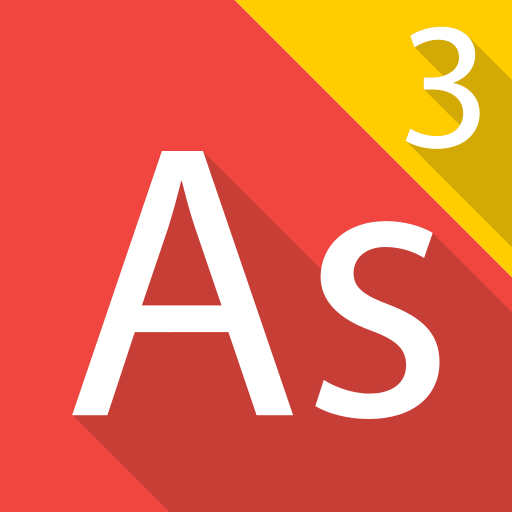

<!-- Distinctly Unique & Beautiful Profile by Hasan AlDoy -->

  

<h1 align="center" style="font-size:3em; letter-spacing:2px; color:#0D0D0D; background: linear-gradient(90deg,#EDEDED,#0D0D0D); border-radius: 1em; padding: 0.5em 0;">قوه..
   إسمي حسن الدّوي
</h1>

أنا من البحرين 🇧🇭

<h1 align="center" style="font-size:3em; letter-spacing:2px; color:#0D0D0D; background: linear-gradient(90deg,#EDEDED,#0D0D0D); border-radius: 1em; padding: 0.5em 0;">Hi..
   My Name is Hasan AlDoy
</h1>

I am from Bahrain 🇧🇭

<h2 align="center" style="font-family:monospace; color:#0D0D0D;">Code is Poetry &mdash; Coding is Art</h2>

  

  

---

<h1 align="center">Hi 👋, I'm Hasan AlDoy 🐧</h1>

  

  Apache Royale Penguin 🐧 
  Wondering the Arabian Desert

<ul style="font-size:1.1em;">
  <li>Born in <a href="https://visitrasalkhaimah.com">R.A.K.</a>, raised in the greatest Island <a href="https://bahrain.com">Kingdom of Bahrain</a></li>
  <li>🤖 <b>Full Stack AI Prompter Engineer</b> (2023): ChatGPT | DALL-E | Stability.ai | Replicate | Certified OpenAI Engineer ⌨️</li>
  <li>🔭 Senior Broadcast Engineer at <a href="https://live.bh">Bahrain TV</a> since 2001</li>
  <li>🎬 Virtual Director of <a href="https://www.youtube.com/channel/UCzXURHgFJuC0QpuFYOHRHeg">VG55</a></li>
  <li>🎮 AlSarya TV Show Broadcast Game Designer</li>
  <li>🧑‍💻 Animator + Lead Developer for <a href="https://alsarya.tv">alsarya.tv</a></li>
  <li>📺 Streamed & Directed many shows since 2001 &mdash; <a href="https://youtube.com/playlist?list=PLjaXnvdACZifh6jEW0fL5UwVT7WcMcJVa">Enjoy it live!</a></li>
  <li>🛰️ One-man show: Live Stream Showcase (May 2022)</li>
</ul>

---

# 🚀 GitHub Stats

  
  
  

## 🏆 GitHub Trophies

  

---

## ✍️ Random Dev Quote

  

## 🔝 Top Contributed Repo

  

---

  

---

  <h2 style="color:#B1002F;">🌟 Recent Projects</h2>
  

    

      
      <b><a href="https://alsarya.tv">AlSarya TV Show</a></b> 2019 - 2025
    

    

      <b><a href="https://doy.tech/undisclosed">Undisclosed</a></b> 2023
    

    

      <b><a href="https://www.youtube.com/channel/UCzXURHgFJuC0QpuFYOHRHeg">VG55</a></b> 2020
    

    

      <b><a href="https://live.bh">Bahrain TV</a></b> 2001 - 2023
    

    

      <b><a href="https://doy.tech/undisclosed">Undisclosed</a></b> 1996
    

    

      <b><a href="https://doy.tech/undisclosed">Undisclosed</a></b> 2021
    

  

---

<h3 align="center">Connect with me</h3>

  
  
  
  

---

📮 Social Contacts 📬

 

## Todoist Stats

<!-- TODO-IST:START -->
🏆 **9,742** Karma Points 🌸 Completed **0** tasks today ✅ Completed **758** tasks so far ⏳ Longest streak is **5** days 📅 Last updated: **Thursday, August 31, 2023**
<!-- TODO-IST:END -->

  
  

  

---

> ### Super 🔋 Powers

  
  
  
  
  

  

I have accepted <b>2,131</b> completions in 20 different coding languages using Codeium from <a href="https://www.codeium.com">www.codeium.com</a>!

  <h2>waves of tech ahead</h2>

  This personal profile represents my role as a <b>sole developer</b>. 
  Hand-crafted by Bahrain's 🇧🇭 Finest Web Artisans ⦿ inspired by @doytech | version 2.2024.05.19

    صفحة شخصية لأعمالي الشخصية والإحترافية في كل من القطاع العام والخاص، المهم ليس فيما ستأخذ بل من أين أخذته؟ <b>حفاظك على المُلكية الفكرية لغيرك هي كافية لحماية حقوقك.</b>

---

  This profile was inspired by several others. 😘
  <a href="https://github.com/elangosundar/awesome-README-templates">awesome-README</a> &amp;&amp;
  <a href="https://github.com/abhisheknaiidu/todoist-readme" target="_blank">todoist-readme</a> &amp;&amp;
  <a href="https://github.com/benjaminsampica/benjaminsampica" target="_blank">benjaminsampica</a>

