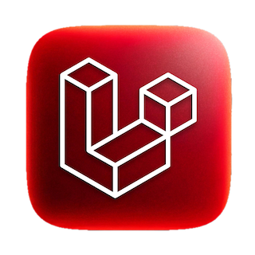

<!-- Distinctly Unique & Beautiful Profile by Hasan AlDoy -->

  

<h1 align="center">
  
</h1>

  

<h2 align="center">
  <em>Code is Poetry • Coding is Art</em>
</h2>

<h3 align="center" style="margin-bottom: 10px">
  Online Since 1996 • Streaming Since 2005 • 1st Place Winner of Bahrain Startup Weekend 2012
</h3>

<h4 align="center" style="margin-bottom: 10px">
  Creating Live TV Interactive Games & Dynamic Info Systems Since 2001
</h4>

  <small>built an airplane while jumping of a cliff, when reached the ground it was a VAN! **AI Generated Plan**</small>

 

  

 

  
   
  

---

## 🎯 About Me

### 🚀 **Apache Royale Penguin 🐧 Wandering the Arabian Desert**

🌍 **Born in [R.A.K.](https://visitrasalkhaimah.com), raised in the greatest Island [Kingdom of Bahrain](https://bahrain.com)**

### 💼 **Professional Journey**
- 🤖 **Full Stack AI Prompter Engineer** (2023): ChatGPT | DALL-E | Stability.ai | Replicate | Certified OpenAI Engineer
- 🔭 **Senior Broadcast Engineer** at [Bahrain TV](https://live.bh) since 2001
- 🎬 **Virtual Director** of [VG55](https://www.youtube.com/channel/UCzXURHgFJuC0QpuFYOHRHeg)
- 🎮 **AlSarya TV Show Broadcast Game Designer**
- 🧑‍💻 **Animator + Lead Developer** for [alsarya.tv](https://alsarya.tv)
- 📺 **Live Stream Director** — [Watch my shows!](https://youtube.com/playlist?list=PLjaXnvdACZifh6jEW0fL5UwVT7WcMcJVa)

---

## 🛠️ Technology Arsenal

### 💻 **Core Languages**

### 🚀 **Frameworks & Tools**

  

> **Note:** Even if there are other respectable frameworks, compared to the Grand Master of them all **Laravel**, they have no chance. Period.

---

## 📊 GitHub Analytics Dashboard

  
  

### 🏆 **GitHub Achievements**

  

### 📈 **Contribution Activity**

  

### 🔥 **Streak Statistics**

  

### ✍️ **Random Dev Quote**

  

---

## 🏗️ Featured Projects

| Project | Description | Year | Status |
|---------|-------------|------|--------|
| [**AlSarya TV Show**](https://alsarya.tv) | Interactive broadcast platform | 2019 - 2025 | 🟢 Active |
| [**VG55**](https://www.youtube.com/channel/UCzXURHgFJuC0QpuFYOHRHeg) | Virtual gaming and streaming channel | 2020 | 🟢 Active |
| [**Bahrain TV**](https://live.bh) | National television broadcasting | 2001 - 2023 | ✅ Complete |
| [**doy.tech Portfolio**](https://doy.tech) | Personal portfolio and services | 2021 | 🟢 Active |

  

---

## 🌐 Connect & Collaborate

<h3>📱 <strong>Social Stats</strong></h3>

---

## 📈 Productivity Stats

<!-- TODO-IST:START -->
🏆 **9,742** Karma Points  
🌸 Completed **0** tasks today  
✅ Completed **758** tasks so far  
⏳ Longest streak is **5** days  
📅 Last updated: **Thursday, August 31, 2023**
<!-- TODO-IST:END -->

  
   
  

---

## 🔝 Top Contributed Repositories

  

---

  
    
  
  ### 🚀 *"Code is poetry, and every commit tells a story"*
  
  ⭐ Feel free to star any repositories you find interesting!
  

---

## 📜 Credits & Inspiration

<strong>Hand-crafted by Bahrain's 🇧🇭 Finest Web Artisans</strong> ⦿ <strong>inspired by @doytech</strong> | <strong>version 3.2025.01.23</strong>

<blockquote>

<em>صفحة شخصية لأعمالي الشخصية والإحترافية في كل من القطاع العام والخاص، المهم ليس فيما ستأخذ بل من أين أخذته؟</em> <strong>حفاظك على المُلكية الفكرية لغيرك هي كافية لحماية حقوقك.</strong>

</blockquote>

<h3>🙏 <strong>Acknowledgments</strong></h3>

This profile was inspired by several talented developers: 
<a href="https://github.com/elangosundar/awesome-README-templates">awesome-README</a> • 
<a href="https://github.com/abhisheknaiidu/todoist-readme">todoist-readme</a> • 
<a href="https://github.com/benjaminsampica/benjaminsampica">benjaminsampica</a>

