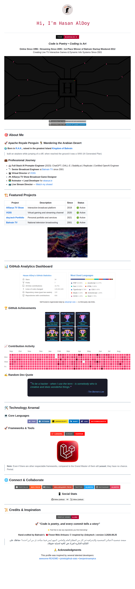

# Profile README — maintenance notes

This folder documents how the profile [`README.md`](../README.md) is put
together and how to check it still renders, since most of what it displays is
fetched live from services outside this repository.

## Preview



Captured from GitHub's own rendering of `README.md` at 1012px — the width
GitHub lays markdown out at — with every image loaded.

## Where each image comes from

| Section | Source | Notes |
|---|---|---|
| Hero typing animation | `readme-typing-svg.demolab.com` | The `herokuapp.com` host this used to point at died with Heroku's free dynos (Nov 2022). |
| Committer rank badges | `user-badge.committers.top` | |
| Animated banner | `svgs/hugo-intro.svg` | Served from this repo. |
| **GitHub Analytics Dashboard** | [`aldoyh/gh-stats`](https://github.com/aldoyh/gh-stats) | Self-hosted. A workflow in that repo regenerates `generated/overview.svg` and `generated/languages.svg` daily and commits them, so this section has no third-party rate limit and cannot 502. |
| GitHub Achievements | `github-trophies.vercel.app` | |
| Contribution Activity | `ghchart.rshah.org` | Tinted `B1002F` to match the profile's accent. |
| Random Dev Quote | `quotes-github-readme.vercel.app` | |
| Tech stack / social badges | `img.shields.io` | |
| Profile views counter | `komarev.com` | |
| Project & framework artwork | `images/`, `logos-n-beyond/` | Served from this repo. |

Anything served from this repo (`gh-stats` included) is the durable half. The
rest is other people's free infrastructure and should be expected to break
eventually — see below.

## Checking the images still load

```bash
python3 docs/verify-readme-images.py               # checks main
python3 docs/verify-readme-images.py --ref my-branch
```

Exits non-zero and lists the dead ones if anything fails.

Requesting a badge service directly is **not** a fair test of what visitors
see. GitHub rewrites every external image in a README to a
`camo.githubusercontent.com` URL, and camo streams the upstream response, so
what a visitor's browser actually fetches is camo. The script therefore asks
GitHub to render the README, pulls the camo URLs out of the rendered HTML and
fetches those — a 502 from camo means the upstream is genuinely down, not that
your own network is blocked.

### Known-dead endpoints

These were all returning 502 consistently when this README was last revised,
which is why they are no longer used. Check before reaching for any of them:

- `github-readme-stats.vercel.app` — the whole instance, including
  `/api`, `/api/top-langs/` and `/api/pin/`. Replaced by self-hosted `gh-stats`.
- `github-profile-trophy.vercel.app` — replaced by `github-trophies.vercel.app`.
- `github-readme-activity-graph.vercel.app` — replaced by `ghchart.rshah.org`.
- `github-contributor-stats.vercel.app` — no working equivalent found; the
  section was dropped, since the `gh-stats` overview card already reports
  repositories contributed to.
- `readme-typing-svg.herokuapp.com` — use `readme-typing-svg.demolab.com`.
- `github-readme-streak-stats.herokuapp.com` — `streak-stats.demolab.com`
  responds, if a streak card is ever wanted back.

## Regenerating the preview

The preview is a real browser screenshot of GitHub's rendered output, not a
mockup. To rebuild it after changing the README:

1. Push the branch so GitHub can render it.
2. Fetch `https://github.com/aldoyh/aldoyh/blob/<branch>/README.md` and extract
   the `<article class="markdown-body">` element.
3. Download each image (the camo URLs, plus repo-local files) and rewrite the
   `src` attributes to point at the local copies, so the page renders with no
   network access.
4. Load it in headless Chromium at a 1012px-wide viewport and screenshot.

Use a viewport tall enough to fit the whole page rather than a full-page
screenshot: the full-page capture path re-rasterises SVGs loaded via ``
at their initial animation frame, which makes the `gh-stats` cards — whose
rows animate in with a CSS `animation-delay` — look empty apart from the first
row.
